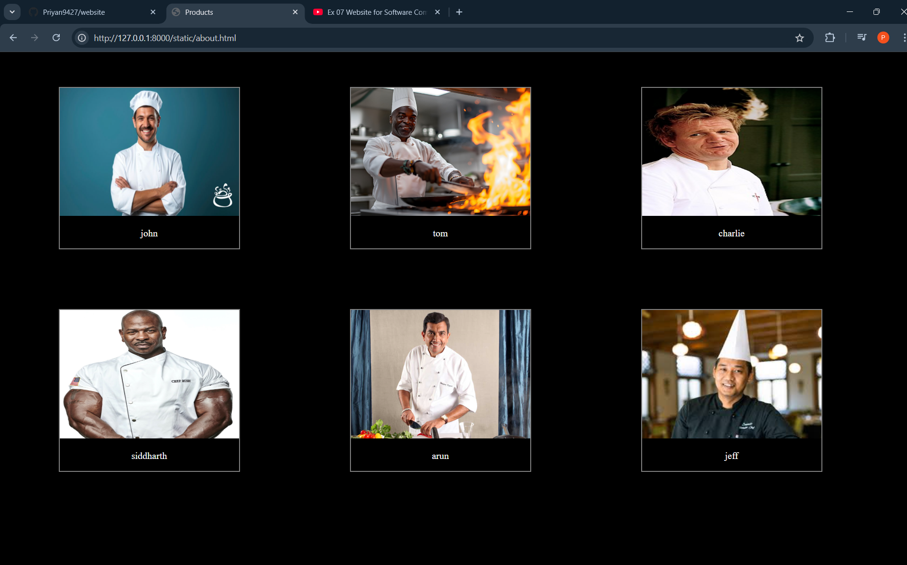

# Ex.07 Restaurant Website
# Date:28/10/24
# AIM:
To develop a static Restaurant website to display the food items and services provided by them.

# DESIGN STEPS:
## Step 1:
Requirement collection.

## Step 2:
Creating the layout using HTML and CSS.

## Step 3:
Updating the sample content.

## Step 4:
Choose the appropriate style and color scheme.

## Step 5:
Validate the layout in various browsers.

## Step 6:
Validate the HTML code.

## Step 7:
Publish the website in the given URL.

# PROGRAM:
```


hotel webpage.html
<!DOCTYPE html>
<html lang="en">
<head>
    <meta charset="UTF-8">
    <meta name="viewport" content="width=device-width, initial-scale=1.0">
    <title>creams cafe</title>
    <link rel="stylesheet" href="hotel webpage.css">
</head>
<body>
    <center>
    <div class="logo"></div>
</center>

<div class="searchbar">
    <input placeholder="search">
    <ul>
        <li><a href="hotel webpage.html">home |</a></li>
        <li> <a href="product.html">products |</a></li>
        <li> <a href="about.html">about us |</a></li>      
        <li> <a href="contact.html">contact us</a></li>
    </ul>
</div>
<center>
<div class="offer">

<h2>Get this at 50% off at tuesday</h2>

</div>
</center>
<div class="box">
    
    <p>Lorem ipsum dolor sit, amet consectetur adipisicing elit. Voluptatum explicabo repellat natus quam! Laudantium molestiae placeat incidunt, at corporis recusandae.</p>
</div>
<div class="box">
    
    <p>Lorem ipsum dolor sit, amet consectetur adipisicing elit. Voluptatum explicabo repellat natus quam! Laudantium molestiae placeat incidunt, at corporis recusandae.</p>
</div>
<div class="box">
    
    <p>Lorem ipsum dolor sit, amet consectetur adipisicing elit. Voluptatum explicabo repellat natus quam! Laudantium molestiae placeat incidunt, at corporis recusandae.</p>
</div>
<div class="box">
    
    <p>Lorem ipsum dolor sit, amet consectetur adipisicing elit. Voluptatum explicabo repellat natus quam! Laudantium molestiae placeat incidunt, at corporis recusandae.</p>
</div>
<div class="box">
    
    <p>Lorem ipsum dolor sit, amet consectetur adipisicing elit. Voluptatum explicabo repellat natus quam! Laudantium molestiae placeat incidunt, at corporis recusandae.</p>
</div>
<div class="box">
    
    <p>Lorem ipsum dolor sit, amet consectetur adipisicing elit. Voluptatum explicabo repellat natus quam! Laudantium molestiae placeat incidunt, at corporis recusandae.</p>
</div>
<div class="about">
    <h1>About Us</h1>
    <p>Lorem ipsum, dolor sit amet consectetur adipisicing elit. At maxime, ea expedita atque voluptatem voluptas labore inventore harum minima nulla accusamus totam maiores dolorem corrupti iste vel rem id exercitationem tempore quo dicta necessitatibus nisi! Ipsa nisi enim veniam eius recusandae asperiores maiores placeat laudantium, magni eos illum tenetur expedita nobis, consequatur pariatur, a officia aspernatur? Deleniti accusantium tempora exercitationem deserunt. Ratione itaque minus similique, error nam libero ea quod inventore consequatur reprehenderit, veritatis doloribus maiores quasi veniam hic maxime magni. Quam nostrum iste architecto ab dignissimos, explicabo rerum vero, a atque repudiandae illo nesciunt magnam culpa optio laudantium debitis exercitationem incidunt tempora officiis dolorum animi facere! Hic qui architecto sint perferendis ea ipsam libero accusamus, dicta doloribus nemo voluptatibus fugiat, odit soluta, deserunt provident incidunt quia alias iste. Quibusdam optio hic autem magni repudiandae, doloribus commodi numquam mollitia, fugiat, dolorem vero! Ipsum aliquid consectetur ad, quibusdam sed reiciendis, aut nihil minima eligendi culpa dolore suscipit quia sapiente. Veritatis necessitatibus rem similique nobis deserunt rerum architecto illum ut itaque ab laboriosam, ipsam nisi, voluptatum amet? Corporis animi iure suscipit. Explicabo aperiam dolorum doloribus consectetur! Maiores similique cum reprehenderit sunt temporibus! Commodi quis quisquam expedita dolorem nihil voluptatem possimus repellat facilis.</p>
</div>
</body>
</html>


hotel webpage.css
*{
    margin: 0px;
    padding: 0px;
    background-color: #14191d;
}
.logo{
    height: 250px;
    width: 500px;
    display: inline-block;
}
.hotellogo{
    height: 250px;
    width: 500px;
}
.searchbar{
    display: inline-block;
    height: 50px;
    width: 1366px;
    background-color: #c7d5ce;
    margin-top: 40px;
    border-style: solid;
    border: 2px;
    border-radius: 10px;
    margin-left: 50px;
}
input{
    width: 340px;
    height: 30px;
    margin-top: 10px;
    margin-left: 10px;
    border-style: solid;
    border: 2px;
    border-radius: 5px;
    padding-left: 5px;
    background-color: white;
    color: black;

}
input,ul,li{
    display: inline;
}
ul,li{
    background-color: #c7d5ce;
    font-size: 20px;
}
ul{
    margin-left: 50%;
}
li {
    color: black;
    cursor: pointer;
}
li :hover{
    color: grey;
}
.offer{
    margin-top: 50px;
    border-color: black;
    border-width: 2px; 
    border-style: solid; 
    display: inline-block; 
    color: white;
    width: 95%;
}
.cake{
    width: 90%;
    height: 400px;
}
.box{
    border-color: black;
    border-width: 2px; 
    border-style: solid; 
    display: inline-block;
    width: 300px;
    color: white;
    margin: 50px;
    margin-left: 100px;
    margin-right: 100px;
}
.boxi{
    width: 300px;
    height: 215px;
}
.about{
    text-align: center;
    padding: 20px;
    margin-top: 20px;
    color: white;
}
a{
    color: black;
    background-color: #c7d5ce;
}


product.html
<!DOCTYPE html>
<html lang="en">
<head>
    <meta charset="UTF-8">
    <meta name="viewport" content="width=device-width, initial-scale=1.0">
    <title>Products</title>
    <link rel="stylesheet" href="product.css">
</head>
<body>
    
    
<div class="box">
    
    <p>@199</p>
</div>
<div class="box">
    
    <p>@599</p>
</div>
<div class="box">
    
    <p>@99</p>
</div>
<div class="box">
    
    <p>@59</p>
</div>
<div class="box">
    
    <p>@99</p>
</div>
<div class="box">
    
    <p>@149</p>
</div>
<div class="box">
    
    <p>@149</p>
</div>
<div class="box">
    
    <p>@99</p>
</div>
<div class="box">
    
    <p>@299</p>
</div>
<div class="box">
    
    <p>@99</p>
</div>
<div class="box">
    
    <p>@299</p>
</div>
<div class="box">
    
    <p>@199</p>
</div>
</body>
</html>


product.css
.box{
    background-color: black;
    border-color: gray;
    border-width: 2px; 
    border-style: solid; 
    display: inline-block;
    width: 300px;
    color: white;
    margin: 50px;
    margin-left: 90px;
    margin-right: 90px;
    text-align: center;
}
.boxi{
    width: 300px;
    height: 215px;
}
*{
    background-color: black;
}


about.html
<!DOCTYPE html>
<html lang="en">
<head>
    <meta charset="UTF-8">
    <meta name="viewport" content="width=device-width, initial-scale=1.0">
    <title>Products</title>
    <link rel="stylesheet" href="about.css">
</head>
<body>
    
    
<div class="box">
    
    <p>john</p>
</div>
<div class="box">
    
    <p>tom</p>
</div>
<div class="box">
    
    <p>charlie</p>
</div>
<div class="box">
    
    <p>siddharth</p>
</div>
<div class="box">
    
    <p>arun</p>
</div>
<div class="box">
    
    <p>jeff</p>
</div>

</body>
</html>

about.css
.box{
    background-color: black;
    border-color: gray;
    border-width: 2px; 
    border-style: solid; 
    display: inline-block;
    width: 300px;
    color: white;
    margin: 50px;
    margin-left: 90px;
    margin-right: 90px;
    text-align: center;
}
.boxi{
    width: 300px;
    height: 215px;
}
*{
    background-color: black;
}


contact.html
<!DOCTYPE html>
<html lang="en">
<head>
    <meta charset="UTF-8">
    <meta name="viewport" content="width=device-width, initial-scale=1.0">
    <title>contact us</title>
    <link rel="stylesheet" href="contact.css">
</head>
<body>

        <h4>Contact</h4>
        <p>+91 9876543210</p>
        <p>hotel@gmail.com</p>
        <p class="lorem" >Lorem ipsum dolor sit amet, consectetur adipisicing elit. Assumenda dolor ut aut veritatis architecto suscipit ullam nulla possimus, reprehenderit, adipisci dicta rerum eos qui omnis eveniet. Maiores quaerat eius saepe porro voluptate perspiciatis ullam iste nostrum, officiis cumque sed doloribus error inventore est enim, debitis animi! Tenetur cupiditate, nisi suscipit nam sapiente at reiciendis, repudiandae fugiat a consequatur est commodi incidunt quis, doloremque eius nulla laudantium tempora recusandae? Nihil doloremque atque, numquam natus dolorum voluptates fugit eveniet dignissimos corporis laborum velit dicta maxime facere aliquid repellat vitae sit dolore beatae corrupti nulla omnis, deleniti recusandae! Sapiente quasi veniam doloremque tenetur!</p>

    
</body>
</html>


contact.css
*{
    text-align: center;
    background-color: black;
    color: white;
}
.lorem{
    margin-top: 30px;
    font-size: 10px;
}


```
# OUTPUT:





# RESULT:
The program for designing software company website using HTML and CSS is completed successfully.
